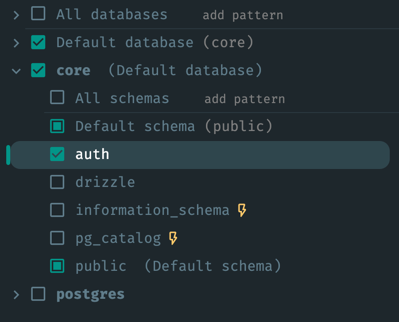
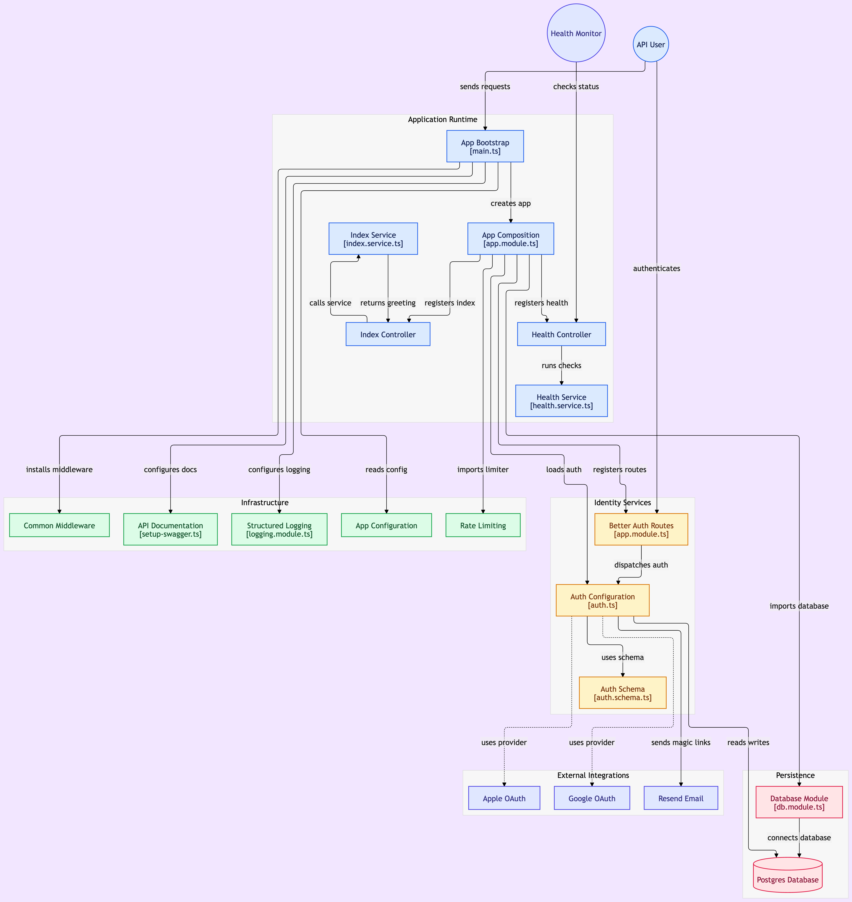

<p align="center">
  <a href="http://nestjs.com/" target="blank"></a>
</p>

<p align="center">
  <a href="https://nestjs.com" target="_blank"></a>
  <a href="https://fastify.dev" target="_blank"></a>
  <a href="https://www.typescriptlang.org" target="_blank"></a>
  <a href="https://pnpm.io" target="_blank"></a>
  <a href="https://www.postgresql.org" target="_blank"></a>
  <a href="https://neon.tech" target="_blank"></a>
  <a href="https://orm.drizzle.team" target="_blank"></a>
  <a href="https://zod.dev" target="_blank"></a>
  <a href="https://www.better-auth.com" target="_blank"></a>
  <a href="https://resend.com" target="_blank"></a>
  <a href="https://swagger.io" target="_blank"></a>
  <a href="https://vitest.dev" target="_blank"></a>
  <a href="https://prettier.io" target="_blank"></a>
  <a href="https://render.com" target="_blank"></a>
</p>

## About

This is a production-ready starting point for building scalable APIs with NestJS. Instead of wiring up authentication, a database layer, logging, and deployment tooling from scratch on every new project, clone this repo and start building features on day one.

The codebase is organized into self-contained modules, each with its own constants file, so the structure stays predictable as the project grows. It comes with authentication via Better Auth (including magic link sign-in and bearer token sessions), a Postgres database wired up through Drizzle ORM, structured logging with pino, health checks, rate limiting, security headers, and a Docker setup for local development and deployment.

## Tech Stack

- Framework: NestJS
- HTTP Engine: Fastify
- Language: TypeScript
- Package Manager: pnpm
- Database: Postgres (Neon)
- ORM: Drizzle
- Migrations: Drizzle Kit
- Validation: Zod
- Auth: better-auth
- Email: Resend
- API Docs: OpenAPI via `@nestjs/swagger`
- Logging: pino via `nestjs-pino`
- Health Checks: `@nestjs/terminus`
- Rate Limiting: `@nestjs/throttler`
- Security Headers: `@fastify/helmet`
- Compression: `@fastify/compress`
- Testing: Vitest
- Linting: oxlint
- Formatting: Prettier
- Pre-commit Hooks: Husky + lint-staged
- Deployment: Render

## Module Structure

Every module follows the same layering, so once you know one module you know them all.

- Constants: magic strings, tokens (including the repository DI token), config values.
- Controller: routes, delegates to service.
- Service: business logic only, depends on the repository interface, never the concrete repository or DB client, throws domain errors, never HTTP exceptions.
- Repository Interface: method signatures only, no implementation.
- Repository: owns all DB queries, uses the injected Drizzle client, returns plain domain objects, never a query builder, translates raw DB failures into domain errors.
- Errors: the module's own domain error classes, extending a thin shared `DomainError` base, defined where they're thrown, not in a shared error file.
- Module: wires controller, service, and providers, binds the repository interface to its implementation.
- Schema: Drizzle table plus drizzle-zod, the validation layer.

The chain becomes Controller → Service → Repository Interface → Repository → DB. Service stays pure business logic, DB access is fully isolated behind an interface, transactions are opened by the service, and errors stay module-owned and domain-shaped until one generic filter (checking only `instanceof DomainError`) maps them to HTTP at the edge.

Not every module needs every piece yet. Some parts of this layering only show up once a module has a use case for them, but new modules should still follow the same shape.

### Example: `conversations` Module

| Layer                | File                                    |
|----------------------|-----------------------------------------|
| Constants            | `conversations.constants.ts`            |
| Controller           | `conversations.controller.ts`           |
| Service              | `conversations.service.ts`              |
| Repository Interface | `conversations.repository.interface.ts` |
| Repository           | `conversations.repository.ts`           |
| Errors               | `conversations.errors.ts`               |
| Module               | `conversations.module.ts`               |
| Schema               | `conversations.schema.ts`               |

## Project Setup

```bash
pnpm install
```

## Compile and Run the App

```bash
# Development
pnpm run start

# Watch mode
pnpm run start:dev

# Production mode
pnpm run start:prod
```

## Run With Docker

### Only Postgres

Starts just the database, so the app runs on the host with `pnpm run start:dev`.

```bash
docker compose up -d postgres
```

Point `DATABASE_URL` in `.env` at the container before starting the app:

### App and Postgres Together

Starts both containers; the `api` service overrides `DATABASE_URL` to point at the `postgres` container automatically.

```bash
docker compose up
```

### Stop the Containers

Stops and removes the containers, network, and the Postgres data volume.

```bash
docker compose down -v
```

## Database Migrations

```bash
# Generate a migration from schema changes
pnpm exec drizzle-kit generate

# Apply pending migrations
pnpm exec drizzle-kit migrate
```

Better Auth's tables live in a separate `auth` Postgres schema, not `public`. Most database clients only display the `public` schema by default, so enable the `auth` schema in your client's schema filter to see them.



## API Documentation

- App Routes: `/docs`
- Auth Routes: `/api/auth/reference`

## Run Tests

```bash
# Unit tests
pnpm run test

# E2E tests
pnpm run test:e2e

# Test coverage
pnpm run test:cov
```

## System Diagram



Generated with [GitDiagram](https://gitdiagram.com/)
